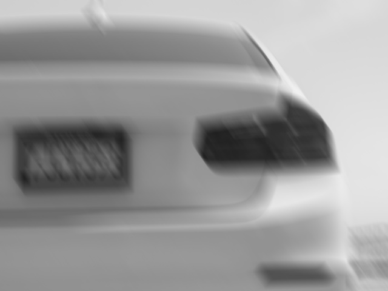
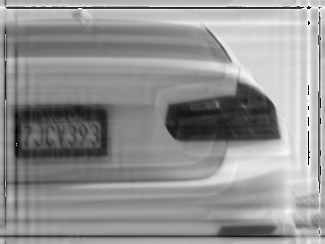
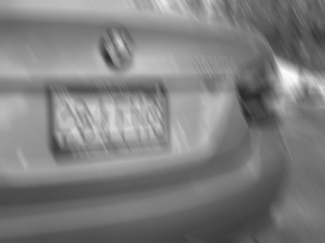
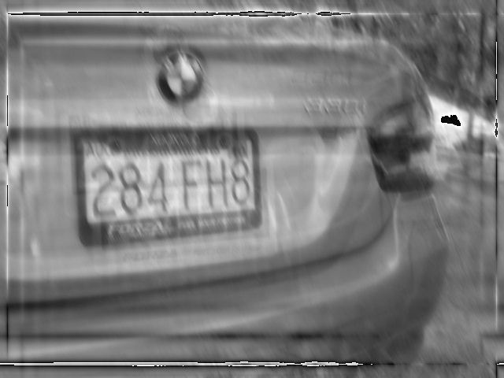
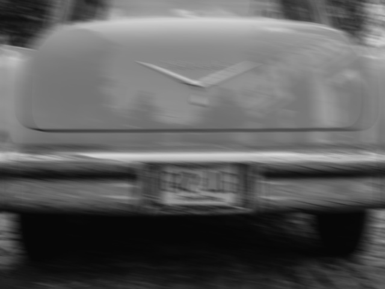
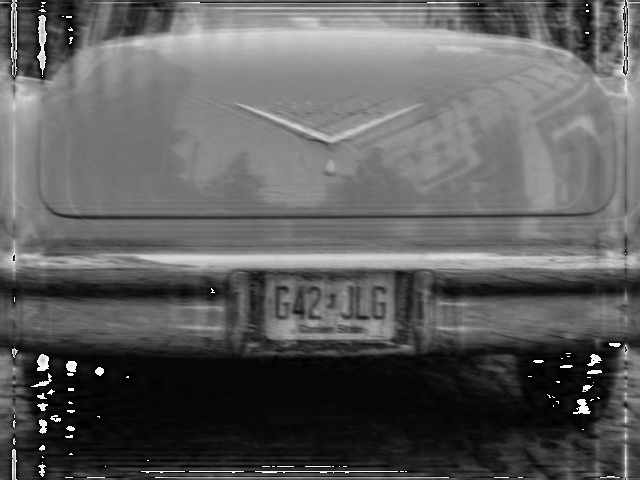

# Blind Motion Deblurring for Legible License Plates using Deep Learning

This project uses deep learning techniques to estimate a length and angle parameter for the point-spread function responsible for motion-deblurring of an image. This estimation is achieved by training a deep CNN model on the fast-fourier transformation of the blurred images. By using enough random examples of motion blurred images, the model learns how to estimate any kind of motion blur (upto a certain blur degree), making this approach a truly blind motion deblurring example. Once a length and angle of motion blur is estimated by the model, one can easily deblur the image using Wiener Deconvolution. This technique can have many applications, but we used it specifically for deblurring and making license plates legible. As seen below, the images demonstrate our model in action. With the introduction of some artifacts, the model manages to deblur the images to a point where the license plates are legible.  

 

 

 

##Package Requirements:-
1. Python3
2. Numpy
3. OpenCV 4
4. Tensorflow 2
5. H5py
6. Imutils
7. Progressbar
8. Scikit-Learn
## How to Run Code:-

### Training the length and angle models:-

1. Download the dataset of images from [here](https://cocodataset.org/#download). Download atleast 20000 images to train models optimally. (We used the COCO dataset to train our model. But any other dataset of general images will also suffice)
2. Use the create_blurred.py to generate the motion blurred dataset as ```python create_blurred.py -i <path_to_input_dir> -o <path_to_output_dir> [-m <optional_number_of_images_to_generate>```. The output directory to store images must exist. The script randomly blurs the images using a random blur length and angle. The range of blur length and angle can be changes on lines 38-39. The script also generates a json file to store the labels for blur length and angle. Note that for blur angle we consider all angle over 180 degrees to be cyclic and wrap around (example 240 is 240-180=60) as it doesn't affect the PSF and significantly reduces the number of classes.
3. Use the create_fft.py to generate the fast-fourier transform images of the blurred images to use for training. Run the script as ```python create_fft.py -i <path_to_input_dir> -o <path_to_output_dir>```. The input directory is the folder where the blurred images are stored. The output directory must be created manually.
4. Use the build_dataset.py to generate the hdf5 dataset to train. We use this to overcome the bottleneck of working with a large number of images in memory. Run the script as ```python build_dataset.py -m <flag to determine which model is being trained: use either "angle" or "length"> -i <path to input fft images> -to <output hdf5 train file name/path. Must end with .hd5f extension> -vo <path/filename to output hd5f val data> -l <path to input labels json file. properly input either angle or length labels>```. We have resized our images to (224x224) to facilitate training. If you plan to use a different size change the lines 51 and 64. Before this script is run make sure to delete any previously present .hdf5 files.
5. Use the angle_model_train.py script to train the model to estimate the angle parameter of the blur. Change the path to the train and val hdf5 files on lines 17 and 18 and run the script as ```python angle_model_train -o <path to store output metrics. Must be created and empyt at the start of training> [-m <model checkpoint path to resume training> [-e <current epoch to restart training from>```. 
6. Similarly, length_model_train.py can be used to train the length model.
7. Remember to properly modify all variables in the train files

### Testing the models to deblur images

Run the deblur_img.py script as ```python deblur_img.py -i <path to input blur image> -a <path to trained angle model> -l <path to trained length model>```. The final deblurred image is saved as result.jpg on the same directory as the script.
